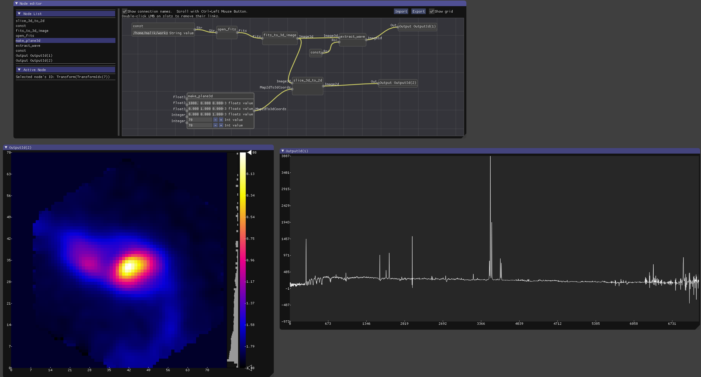

# Aflak - アフラーク

**Aflak** - A visualization environment to analyze astronomical datasets
by providing a visual programming language interface.

[](https://travis-ci.org/aflak-vis/aflak)
[](https://crates.io/crates/aflak)



**IN ACTIVE DEVELOPMENT: Features and API highly unstable!**

## Download binary (nightly)

- [Linux](https://aflak-vis.github.io/download/build/linux/aflak-linux-3dee6276f.tar.gz)
- [macOS](https://aflak-vis.github.io/download/build/macos/aflak-macos-3dee6276f.tar.gz)


## Getting started

```sh
# Open a FITS file with aflak
aflak -f <FITS_FILE>
# See CLI help
aflak --help
```

You may find a demo video [here](https://vimeo.com/290328343).

**Disclaimer**: Most testing until now has been done with FITS files sampled
from the [SDSS MaNGA](https://www.sdss.org/surveys/manga/), and some files
from ALMA. Standard-compliant FITS should be openable without issue, if
you meet any issue, please file an issue, provide the FITS file, a
screenshot and explain what's wrong/unexpected.

**NB**:
- The first time you run aflak, the window layout may not be what you
prefer. You may want to resize / move some windows with the mouse the
very first time your run aflak.
Hopefully, aflak remembers the arrangement of your windows between sessions.
- It is advised to use aflak with a large screen more 2000-pixel large
for a better experience. 3000-pixel is even better!


## Build from source

Minimum Rust version: 1.36.0.

Install the rust toolchain with [rustup](https://rustup.rs/).
You will need a working C & C++ environment to install from sources.

### Quick install (nightly)

```sh
cargo install --git https://github.com/aflak-vis/aflak aflak
```

### Update

If aflak is already installed, just append the `--force` flag to the `cargo`
command in order to overwrite the current install of aflak with a new one.

```sh
cargo install --force --git https://github.com/aflak-vis/aflak aflak
```

### Slower install

Clone the git repository.
You will need to initialize the git submodules.

```sh
git clone https://github.com/aflak-vis/aflak
cd aflak/src
git submodule update --init --recursive
cargo install --path .
```

### Build

```sh
cd aflak/src
cargo build --release
```

## Run aflak from source

```sh
cd aflak/src
cargo run --release -- -f <FITS_FILE>
```

## Contributing, bug report, feature request

Please read [the contribution guide](./CONTRIBUTING.md).

## [Newsletter](https://mailchi.mp/c94954601fe9/aflak-newsletter-subscription)

Please fill your e-mail address on [this
link](https://mailchi.mp/c94954601fe9/aflak-newsletter-subscription) to
subscribe to aflak's monthly newsletter and follow aflak's development.
