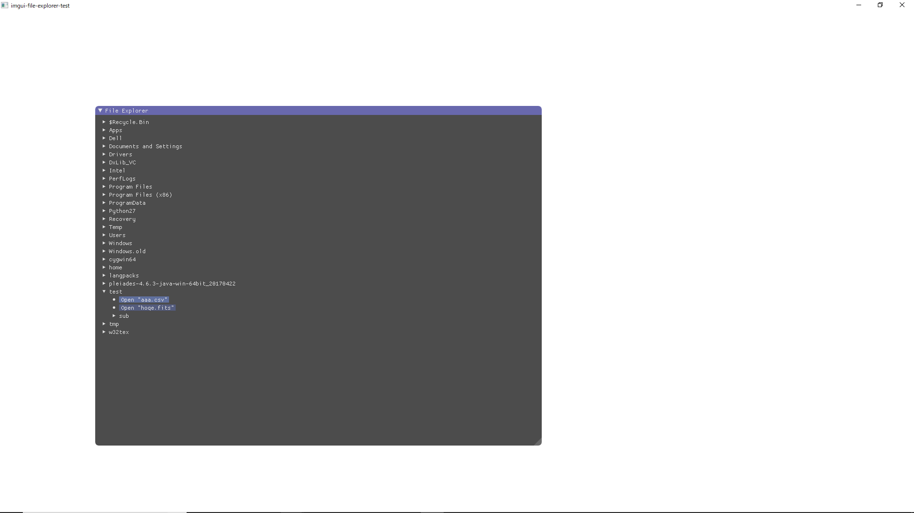

# imgui-file-explorer crate



## Run
```sh
git submodule update --init --recursive
cargo run --example test
```

## TODO
- Consider and implement API
- Get files' permissions
- Change target directory/filtering by name or extension
- Load some recent files
